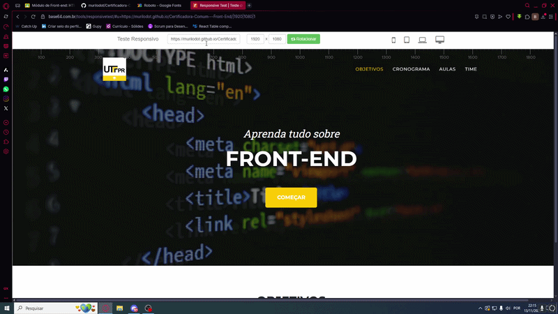

# Certificadora de Competência Comum (AS64C)
### Turma N14 - 2025/2

Este repositório documenta o desenvolvimento do projeto para a disciplina de Certificadora, focado na criação de materiais educacionais gratuitos e acessíveis para o ensino de tecnologia.

---

  

## 🚀 Proposta do Projeto
Nosso objetivo foi criar uma trilha de aprendizado de **Front-end** (HTML e CSS) pensada para quem está começando do zero. O foco foi entregar um conteúdo direto, visualmente atraente e fácil de consumir, utilizando uma estrutura de curso completa.

O projeto conta com:
* **Videoaulas** explicativas.
* **Exercícios práticos** para fixação.
* **Slides de apoio** via Google Classroom.
* **Site institucional** para centralizar as informações.

## 🛠️ Metodologia de Trabalho
Para organizar o fluxo de entregas em um grupo de 4 pessoas, utilizamos metodólogias ágeis:

* **Scrum:** Rodamos 8 sprints de 3 semanas. Toda semana realizamos check-ins com o professor para validar o progresso e ajustar as metas.
* **Kanban (Trello):** Centralizamos a gestão de tarefas no Trello, o que ajudou a visualizar os gargalos e garantir que cada integrante soubesse exatamente sua responsabilidade no ciclo atual.

## 🖋️ Minhas Contribuições
Fiquei responsável pelas seguintes frentes no projeto:
* **Planejamento:** Elaboração da estrutura inicial e slides de proposta.
* **Desenvolvimento Web:** Criação do site oficial utilizando Bootstrap para garantir uma interface responsiva, moderna e otimizada para diferentes tamanhos de tela.
* **Produção de Conteúdo:** Gravação das videoaulas de **HTML, CSS e Testes de Responsividade**. Além disso, fiz a edição de vídeos.

## 🧠 O que aprendi com este projeto
* **Comunicação Técnica:** O desafio de explicar conceitos de HTML e CSS de forma que uma pessoa leiga consiga entender.
* **Trabalho em Equipe:** Coordenação via Trello para que as partes individuais se encaixassem perfeitamente no produto final. Além de reuniões via discord para alinhamento de ideias entre o grupo.
* **Gestão de Tempo:** Aprender a lidar com o ciclo de sprints e prazos curtos sem comprometer a qualidade.

## 👥 Integrantes do Grupo

<table align="center">
  <tr>
    <td align="center">
      <a href="https://github.com/BrunoBiazon">
         
        <b>Bruno Biazon</b>
      </a>
    </td>
    <td align="center">
      <a href="https://github.com/gabpanagio">
         
        <b>Gabriel Panágio</b>
      </a>
    </td>
    <td align="center">
      <a href="https://github.com/murilodot">
         
        <b>Murilo</b>
      </a>
    </td>
    <td align="center">
      <a href="https://github.com/FaelMoreiraRosa">
         
        <b>Rafael Moreira</b>
      </a>
    </td>
  </tr>
</table>

## 🔗 Links de Acesso
* 🐱 **Repositório Primário:** https://github.com/murilodot/Certificadora-Comum---Front-End/tree/main
* 🌐 **Site do Projeto:** https://brunobiazon.github.io/Frontend-Comunidade-Certificadora/
* 🏫 **Google Classroom:** [Acesse a Turma Aqui](https://classroom.google.com/c/ODA2NjMyOTQ3MzQ0?cjc=rvvdjzq4)
* 🔑 **Código da Turma:** `rvvdjzq4`
